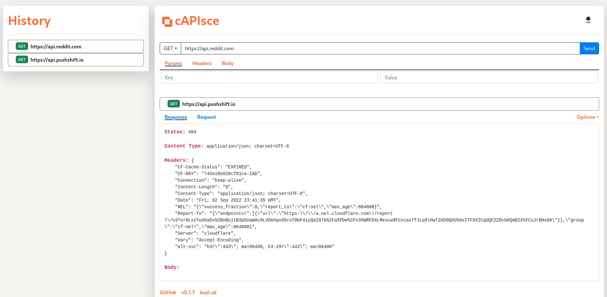

[](https://github.com/kaangiray26/capisce/blob/main/LICENSE)
[](https://github.com/kaangiray26/capisce/issues)

# capisce
The Open-Source API Testing Tool

`capisce` is an easy-to-use testing platform for APIs. For now we have the following features:

* Make GET, HEAD, POST, PUT, DELETE, OPTIONS and PATCH requests
* Display response/request data
* Create previews for response body with content types such as text, image, video, audio, etc.
* See your history of requests
* Switch between requests from the history and show up their data
* Download response body according to the associated MIME types

## PyPI
https://pypi.org/project/sourtimes/

## Installation
```
pip install sourtimes
```

## Quickstart
The package provides a command-line tool named `capisce`, which runs a local web server at http://127.0.0.1:5000/. Normally, the tool is configured to open up the webpage automatically.

However, if you want to use an online instance, check out the following website:

## https://capisce.buzl.uk/

---

## Screenshots
